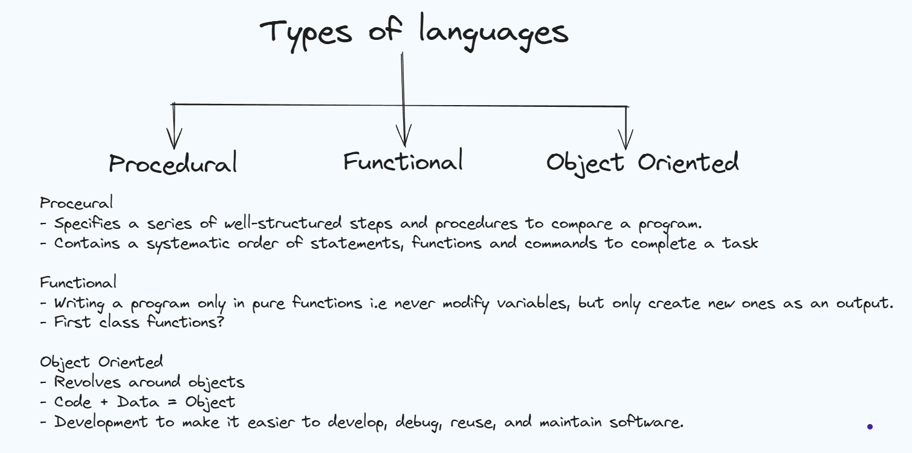
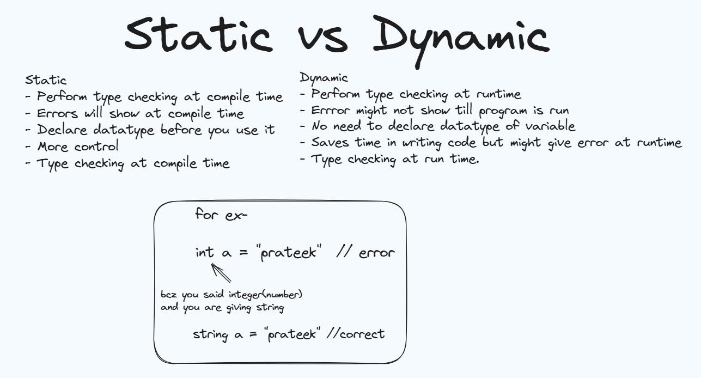
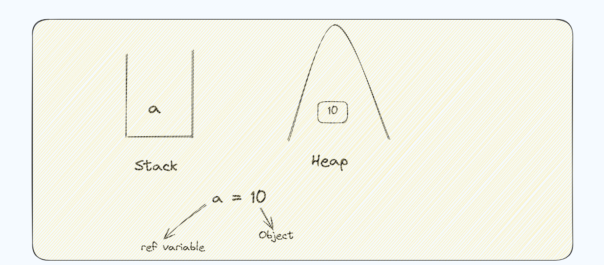
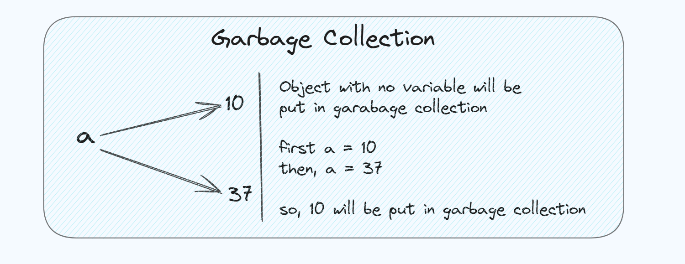

## Programming Concepts Index

---
1. [Types of Programming Languages](#types-of-language)
   - Procedural Languages
   - Functional Languages
   - Object-Oriented Languages

2. [Static vs Dynamic Languages](#static-vs-dynamic)
   - Static Languages
   - Dynamic Languages

3. [Stack vs Heap](#stack-vs-heap)
   - Stack
   - Heap

4. [Garbage Collection](#garbage-collection)
   - Purpose
   - How It Works
   - Types of Garbage Collection Algorithms
   - Languages and Garbage Collection
   - Advantages and Disadvantages

# Programming Paradigms: A Beginner's Guide

### Types Of Language

## Procedural Languages

**Explanation**:
- Think of this as a step-by-step recipe. 
- You write a series of instructions (procedures) that tell the computer what to do, one step at a time.

- Procedural programming is a paradigm based on the concept of procedure calls, where statements are structured into procedures (also known    as routines or functions). Examples include C, Pascal, and BASIC. It focuses on a sequence of computational steps to be carried out.

**Examples**:
- C
- Pascal
- BASIC

## Functional Languages

**Explanation**:
- Imagine you're doing math. In functional languages, you write functions (like math formulas) that take inputs and produce outputs without changing anything else. It's all about applying functions.

- Functional programming is a paradigm where programs are constructed by applying and composing functions. It emphasizes the application of functions, often without changing the state or mutating data. Examples include Haskell, Lisp, and Erlang. Functional programming promotes a declarative coding style.

**Examples**:
- Haskell
- Lisp
- Erlang

## Object-Oriented Languages

**Explanation**:
- Picture a real-world object, like a car. In object-oriented programming, you create objects (like cars) that have characteristics (like color, speed) and behaviors (like drive, stop).

- Object-oriented programming (OOP) is a paradigm based on the concept of objects, which can contain data (in the form of fields, often known as attributes or properties) and code (in the form of procedures, often known as methods). Examples include Java, C++, and Python. OOP focuses on the principles of encapsulation, inheritance, and polymorphism to create reusable and modular code.

**Examples**:
- Java
- C++
- Python

[Back to Top](#programming-concepts-index)
---

# Understanding Programming Languages: Static vs Dynamic

### Static vs Dynamic

## Static Languages

**Explanation**:
- Imagine building a LEGO model where every piece has a fixed shape and size. In static languages, the type of each variable is determined at compile time, and it cannot change during runtime.

**Book Definitions**:
- Static programming languages are those in which the type of a variable is known at compile time. 
- Once a variable is declared with a specific type, it cannot change to a different type during the execution of the program. 

**Examples**:
- Java
- C
- C++

## Dynamic Languages

**Explanation**:
- Think of a set of building blocks where you can add or remove pieces freely. 
- In dynamic languages, variables can change types during runtime, providing more flexibility but requiring careful management.

**Book Definitions**:
- Dynamic programming languages are those in which the type of a variable is determined during runtime. 
- Variables can change types dynamically based on the values assigned to them.

**Examples**:
- Python
- JavaScript
- Ruby

[Back to Top](#programming-concepts-index)
---

## Understanding Stack and Heap in Memory Management

### Stack vs Heap

### Simple Explanations

1. **Stack**:
   - Think of the stack as a place where variables are stored in a neat, organized manner. It's like stacking plates, where the most recent one added is the first to be removed. The stack is used for storing variables and function call information.

   - **Memory Allocation**:
     - Stores variables and function call information in a last-in, first-out (LIFO) manner.
     - Each time a function is called, a new block is added to the stack for that function's variables and state.
   - **Scope and Lifetime**:
     - Variables stored on the stack have a limited scope, typically restricted to the function in which they are declared.
     - These variables are automatically deallocated when the function returns.
   - **Performance**:
     - Fast access due to the organized nature of stack memory.
     - Memory management is straightforward and handled automatically.
   - **Usage**:
     - Used for primitive data types (e.g., int, float) and references to objects.
     - Function call information, including return addresses and local variables, is stored on the stack.

2. **Heap**:
   - The heap is like a large bin where objects are stored. You can put objects in and take them out in any order. The heap is used for dynamic memory allocation, storing objects that may need to persist beyond the function calls that created them.

   - **Memory Allocation**:
     - Stores objects and data that require dynamic memory allocation.
     - Memory is allocated and freed in an arbitrary order, which can lead to fragmentation.
   - **Scope and Lifetime**:
     - Objects stored on the heap can persist beyond the function calls that created them.
     - The lifetime of these objects is managed by the programmer (in languages like C/C++) or by garbage collection (in languages like Java).
   - **Performance**:
     - Slower access compared to stack memory due to the overhead of managing dynamic allocation.
     - Can lead to memory fragmentation and requires garbage collection or manual management.
   - **Usage**:
     - Used for creating objects that need to persist beyond the scope of a single function call.
     - Allows for the allocation of large amounts of memory that may not fit on the stack.

    [Back to Top](#programming-concepts-index)
---

## Understanding Garbage Collection

### Garbage Collection

### Simple Explanation

**Garbage Collection**:
   - Think of garbage collection as a cleaning service for your computer's memory. It automatically finds and removes objects that are no longer needed, freeing up space and preventing memory leaks.

### Detailed Definition

**Garbage Collection**:
   - **Purpose**:
     - Garbage collection (GC) is a form of automatic memory management. Its primary purpose is to reclaim memory occupied by objects that are no longer in use by the program, thus preventing memory leaks and optimizing memory usage.
   - **How It Works**:
     - The garbage collector automatically identifies objects that are no longer reachable or needed by the application.
     - It then deallocates the memory used by these objects, making it available for future allocations.
   - **Types of Garbage Collection Algorithms**:
     - **Mark-and-Sweep**:
       - This algorithm involves two phases:
         - **Mark Phase**: The GC traverses all reachable objects starting from the root (such as global variables and active stack frames) and marks them as reachable.
         - **Sweep Phase**: It then scans the entire memory to find unmarked objects and deallocates their memory.
     - **Reference Counting**:
       - Each object has a counter that tracks the number of references to it. When the reference count drops to zero, the object's memory is reclaimed.
       - This method can struggle with cyclic references, where two or more objects reference each other but are otherwise unused.
     - **Generational Garbage Collection**:
       - Objects are categorized into generations based on their lifespan. Young objects (short-lived) are collected more frequently than old objects (long-lived), optimizing GC performance.
       - Examples include the Young Generation, Old Generation, and Permanent Generation (in Java's HotSpot JVM).
   - **Languages and Garbage Collection**:
     - **Java**:
       - Uses automatic garbage collection as part of the Java Virtual Machine (JVM). It employs a combination of mark-and-sweep, generational GC, and other techniques.
     - **Python**:
       - Implements garbage collection using reference counting with an additional cycle-detecting collector to handle cyclic references.
     - **C#**:
       - Utilizes garbage collection within the .NET framework, using a generational approach similar to Java.
     - **JavaScript**:
       - Typically uses garbage collection within the JavaScript engine of a browser, such as V8 in Google Chrome, employing mark-and-sweep or generational techniques.
   - **Advantages**:
     - **Automatic Memory Management**: Reduces the need for manual memory management, minimizing programming errors such as memory leaks and dangling pointers.
     - **Improved Safety**: Helps prevent common bugs related to memory corruption and incorrect deallocation.
   - **Disadvantages**:
     - **Performance Overhead**: Can introduce pauses in program execution due to the garbage collection process.
     - **Unpredictability**: May lead to unpredictable pauses in real-time or performance-critical applications.

[Back to Top](#programming-concepts-index)
---   