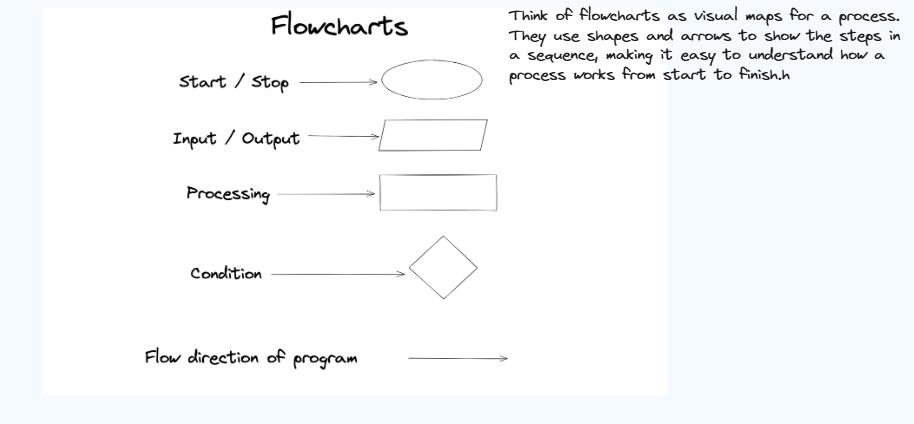
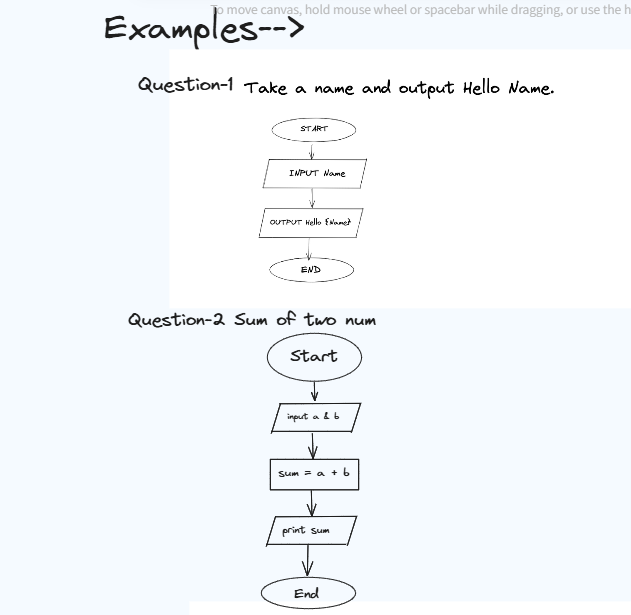
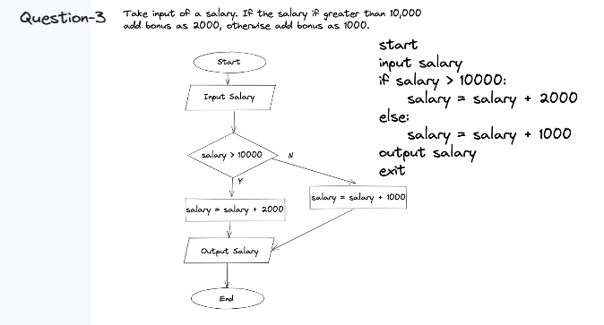
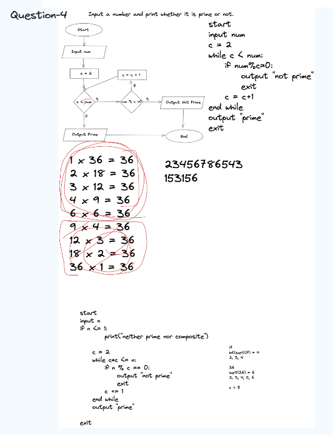
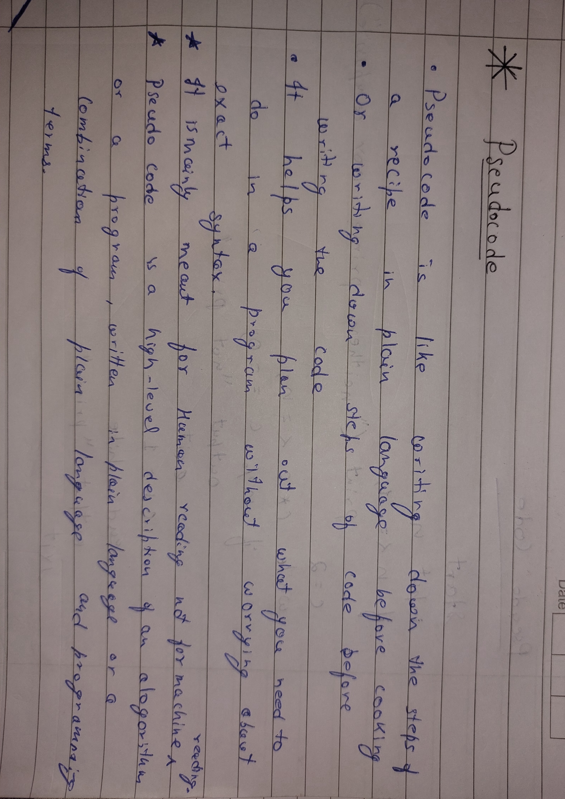

1. [Flowcharts](#flowcharts)
   - Purpose
   - Basic Components
   - Types of Flowcharts
   - Advantages
   - How to Create a Flowchart

2. [Pseudocode](#pseudocode)
   - Purpose
   - Characteristics
   - Components
   - Advantages
   - Example of Pseudocode
   - Converting Pseudocode to Code

---

### Understanding Flowcharts

### Flowcharts



### Simple Explanation

**Flowcharts**:
   - Think of flowcharts as visual maps for a process. They use shapes and arrows to show the steps in a sequence, making it easy to understand how a process works from start to finish.

### Detailed Definition

**Flowcharts**:
   - **Purpose**:
     - Flowcharts are diagrams that visually represent the flow of a process or system, illustrating the steps involved and the order in which they occur.
     - They are used to simplify complex processes, making it easier to understand and communicate how a process works.

   - **Examples**:

      -    
      -    
      -    

   - **Basic Components**:
     - **Start/End**: Represented by oval shapes, these indicate the beginning and end points of the flowchart.
     - **Process**: Represented by rectangles, these indicate steps or actions taken in the process.
     - **Decision**: Represented by diamonds, these indicate points where a decision must be made, leading to different paths based on the outcome.
     - **Input/Output**: Represented by parallelograms, these indicate data or materials entering or leaving the process.
     - **Arrows**: Indicate the direction of flow from one step to the next.
   - **Types of Flowcharts**:
     - **Process Flowchart**: Depicts the steps involved in a process or workflow.
     - **Swimlane Flowchart**: Divides the flowchart into lanes to show which department or individual is responsible for each step.
     - **Data Flow Diagram (DFD)**: Shows the flow of data within a system, emphasizing the inputs and outputs of each process.
     - **System Flowchart**: Illustrates the flow of data through a system, often used in software development to show how different components interact.
   - **Advantages**:
     - **Clarity**: Simplifies complex processes, making them easier to understand and analyze.
     - **Communication**: Provides a visual representation that can be easily shared and discussed among team members.
     - **Problem-Solving**: Helps identify bottlenecks, redundancies, and inefficiencies in a process, aiding in optimization and improvement.
   - **How to Create a Flowchart**:
     - **Identify the Process**: Determine the process or system to be visualized.
     - **Define Steps**: List all the steps involved in the process.
     - **Choose Symbols**: Use standard flowchart symbols to represent different types of actions and decisions.
     - **Connect Steps**: Use arrows to show the flow from one step to the next.
     - **Review and Refine**: Check the flowchart for accuracy and completeness, making adjustments as needed.

   

[Back to Top](#programming-concepts-index)

---

## Understanding Pseudocode

### Pseudocode

**Pseudocode**:
   - Pseudocode is like writing down the steps of a recipe in plain language before cooking. It helps you plan out what you need to do in a program without worrying about exact syntax.

- **Examples**:
       

### Detailed Definition

**Pseudocode**:
   - **Purpose**:
     - Pseudocode is a high-level description of an algorithm or a program, written in plain language or a combination of plain language and programming terms.
     - It is used to plan and discuss algorithms without getting bogged down by the syntax of a specific programming language.
   - **Characteristics**:
     - **Language-agnostic**: Does not adhere to the syntax rules of any particular programming language.
     - **Readable**: Designed to be easily understood by humans, including those who may not be familiar with programming.
     - **Structured**: Uses common programming constructs like loops, conditionals, and functions to describe the flow of the program.
   - **Components**:
     - **Variables**: Used to store data.
     - **Control Structures**: Includes if-else statements, loops (for, while), and case statements to control the flow of the program.
     - **Indentation**: Often used to show the structure and hierarchy of the code.
     - **Comments**: May include explanations or notes to clarify certain steps.
   - **Advantages**:
     - **Simplifies Complexity**: Breaks down complex algorithms into understandable steps.
     - **Facilitates Communication**: Helps developers and non-developers discuss and refine algorithms collaboratively.
     - **Improves Planning**: Provides a clear plan before actual coding begins, reducing errors and improving efficiency.
   - **Example of Pseudocode**:
     - **Task**: Find the largest number in a list.
     ```plaintext
     START
     SET largest to first element in the list
     FOR each element in the list
         IF the element is greater than largest
             SET largest to the element
         ENDIF
     ENDFOR
     PRINT largest
     END
     ```
   - **Converting Pseudocode to Code**:
     - Pseudocode serves as a blueprint for writing actual code in any programming language. Each step in pseudocode translates to specific syntax in the chosen language.
     - **Example in Python**:
       ```python
       # Start
       largest = my_list[0]
       for element in my_list:
           if element > largest:
               largest = element
       # End
       print(largest)
       ```

[Back to Top](#programming-concepts-index)

---


