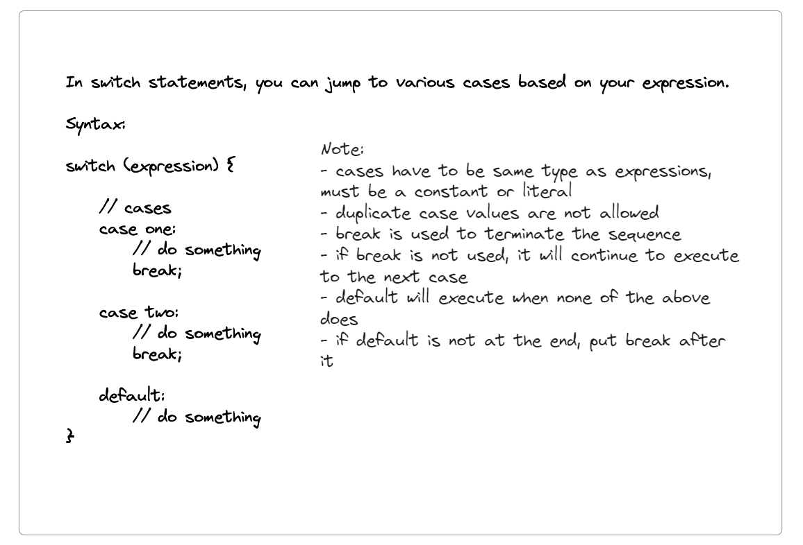

# Switch Statements in Java

## Index
- [Switch Syntax](#switch-syntax)
- [Basic Switch Example](#basic-switch-example)
- [Enhanced Switch Example](#enhanced-switch-example)
- [Day of the Week Example](#day-of-the-week-example)
- [Day Type Example (Weekday/Weekend)](#day-type-example-weekdayweekend)
- [Nested Switch Example](#nested-switch-example)
- [Notes on Switch Statements](#notes-on-switch-statements)

## Switch Syntax
In switch statements, you can jump to various cases based on your expression.



## Basic Switch Example

```java
package com.prateek;

import java.util.Scanner;

public class Main {
    public static void main(String[] args) {
        Scanner input = new Scanner(System.in);
        String fruit = input.next();

        switch (fruit) {
            case "Mango":
                System.out.println("King of fruits");
                break;
            case "Apple":
                System.out.println("A sweet red fruit");
                break;
            case "Orange":
                System.out.println("Round fruit");
                break;  // for ex: if break is not used here, all cases after this will execute
            case "Grapes":
                System.out.println("Small fruit");
                break;
            default:
                System.out.println("please enter a valid fruit");
        }
    }
}
```
[Back to Index](#index)

## Enhanced Switch Example

The enhanced switch statement in Java simplifies the syntax and eliminates the need for break statements.

```java
package com.prateek;

import java.util.Scanner;

public class Main {
    public static void main(String[] args) {
        Scanner input = new Scanner(System.in);
        String fruit = input.next();

        switch (fruit) {
            case "Mango" -> System.out.println("King of fruits");
            case "Apple" -> System.out.println("A sweet red fruit");
            case "Orange" -> System.out.println("Round fruit");
            case "Grapes" -> System.out.println("Small fruit");
            default -> System.out.println("please enter a valid fruit");
        }
    }
}
```
[Back to Index](#index)

## Day of the Week Example

```java
package com.prateek;

import java.util.Scanner;

public class Main {
    public static void main(String[] args) {
        Scanner input = new Scanner(System.in);
        int day = input.nextInt();

        switch (day) {
            case 1 -> System.out.println("Monday");
            case 2 -> System.out.println("Tuesday");
            case 3 -> System.out.println("Wednesday");
            case 4 -> System.out.println("Thursday");
            case 5 -> System.out.println("Friday");
            case 6 -> System.out.println("Saturday");
            case 7 -> System.out.println("Sunday");
        }
    }
}
```
[Back to Index](#index)

## Day Type Example (Weekday/Weekend)

```java
package com.prateek;

import java.util.Scanner;

public class Main {
    public static void main(String[] args) {
        Scanner input = new Scanner(System.in);
        int day = input.nextInt();

        switch (day) {
            case 1, 2, 3, 4, 5 -> System.out.println("Weekday");
            case 6, 7 -> System.out.println("Weekend");
        }
    }
}
```
[Back to Index](#index)

## Nested Switch Example

Nested switch statements allow you to use a switch statement within another switch statement.

```java
package com.prateek;

import java.util.Scanner;

public class NestedSwitch {
    public static void main(String[] args) {
        Scanner in = new Scanner(System.in);
        int empID = in.nextInt();
        String department = in.next();

        switch (empID) {
            case 1:
                System.out.println("Prateek Chouhan");
                break;
            case 2:
                System.out.println("Billy Butcher");
                break;
            case 3:
                System.out.println("Emp Number 3");
                switch (department) {
                    case "IT":
                        System.out.println("IT Department");
                        break;
                    case "Management":
                        System.out.println("Management Department");
                        break;
                    default:
                        System.out.println("No department exists");
                }
                break;
            default:
                System.out.println("Enter correct empID");
        }
    }
}
```

### Enhanced Nested Switch Example

```java
package com.prateek;

import java.util.Scanner;

public class NestedSwitch {
    public static void main(String[] args) {
        Scanner in = new Scanner(System.in);
        int empID = in.nextInt();
        String department = in.next();

        switch (empID) {
            case 1 -> System.out.println("Prateek Chouhan");
            case 2 -> System.out.println("Billy Butcher");
            case 3 -> {
                System.out.println("Emp Number 3");
                switch (department) {
                    case "IT" -> System.out.println("IT Department");
                    case "Management" -> System.out.println("Management Department");
                    default -> System.out.println("No department exists");
                }
            }
            default -> System.out.println("Enter correct empID");
        }
    }
}
```
[Back to Index](#index)

## Notes on Switch Statements

- **Cases** must be the same type as expressions, must be a constant or literal.
- **Duplicate case values** are not allowed.
- **Break** is used to terminate a sequence of statements.
- If **break** is not used, it will continue to execute the next case.
- **Default** will execute when none of the above cases match.
- If **default** is not at the end, put a break after it.

- **Cases** must be the same type as expressions, must be a constant or literal.
    - **Example:**
        ```java
        switch (fruit) {
            case "Mango":
                System.out.println("King of fruits");
                break;
            // other cases
        }
        ```

- **Duplicate case values** are not allowed.
    - **Example:**
        ```java
        switch (number) {
            case 1:
                System.out.println("One");
                break;
            case 1: // This will cause an error
                System.out.println("Duplicate case");
                break;
        }
        ```

- **Break** is used to terminate a sequence of statements.
    - **Example:**
        ```java
        switch (day) {
            case 1:
                System.out.println("Monday");
                break; // without this break, the next case will also execute
            case 2:
                System.out.println("Tuesday");
                break;
        }
        ```

- If **break** is not used, it will continue to execute the next case.
    - **Example:**
        ```java
        switch (day) {
            case 1:
                System.out.println("Monday");
            case 2:
                System.out.println("Tuesday"); // This will also execute if day is 1
                break;
        }
        ```

- **Default** will execute when none of the above cases match.
    - **Example:**
        ```java
        switch (fruit) {
            case "Mango":
                System.out.println("King of fruits");
                break;
            default:
                System.out.println("Please enter a valid fruit");
        }
        ```

- If **default** is not at the end, put a break after it.
    - **Example:**
        ```java
        switch (fruit) {
            default:
                System.out.println("Please enter a valid fruit");
                break;
            case "Mango":
                System.out.println("King of fruits");
                break;
        }
        ```

[Back to Index](#index)

---
## Differences between Normal and Enhanced Switch

- **Syntax:** The enhanced switch uses the `->` syntax which is more concise and readable.
- **Break Statement:** In the enhanced switch, there is no need for explicit break statements to terminate case blocks.
- **Multiple Cases:** The enhanced switch allows multiple cases to share the same statement more cleanly.

---